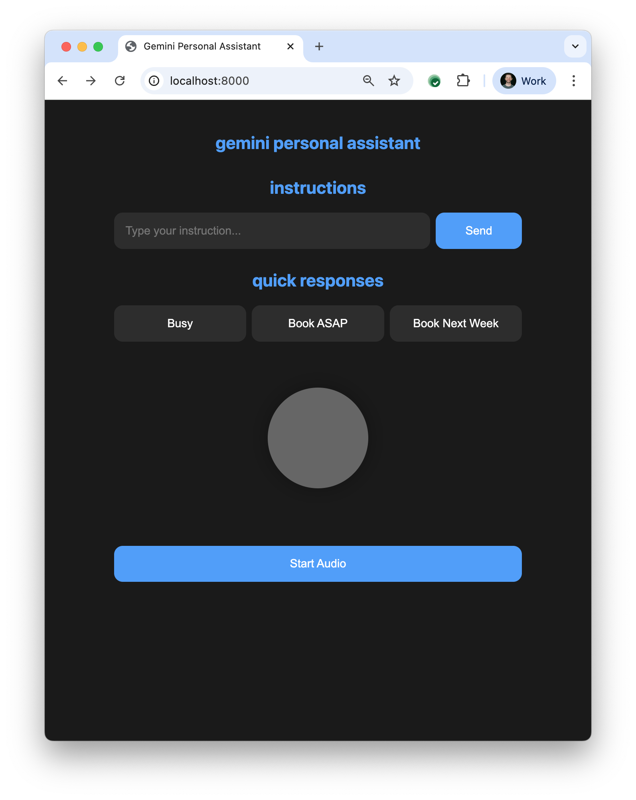

# Gemini Live PA demo

A personal assistant that answers your phone.




## Environment Setup

1. Clone the repository:
```bash
git clone https://github.com/antonpp/pa-demo.git
cd pa-demo
```

2. Install dependencies:
```bash
npm install
```

3. Copy `.env.example` to `.env` and edit it with your credentials:
```bash
cp .env.example .env
# Edit .env with your preferred text editor
```

## Available Scripts

- `npm start` - Start the server in production mode
- `npm run dev` - Start the server in development mode with hot reloading
- `npm run build` - Compile TypeScript to JavaScript

## Running the Application

1. Start the server:
```bash
npm run dev
```

2. Open your browser and navigate to:
```
http://localhost:8000
```

## Project Structure

- `src/live_server.ts` - Main server implementation
- `index.html` - Web interface
- `app.js` - Frontend application logic
- `styles.css` - Application styles
- `src/prompts/` - System instructions and prompts